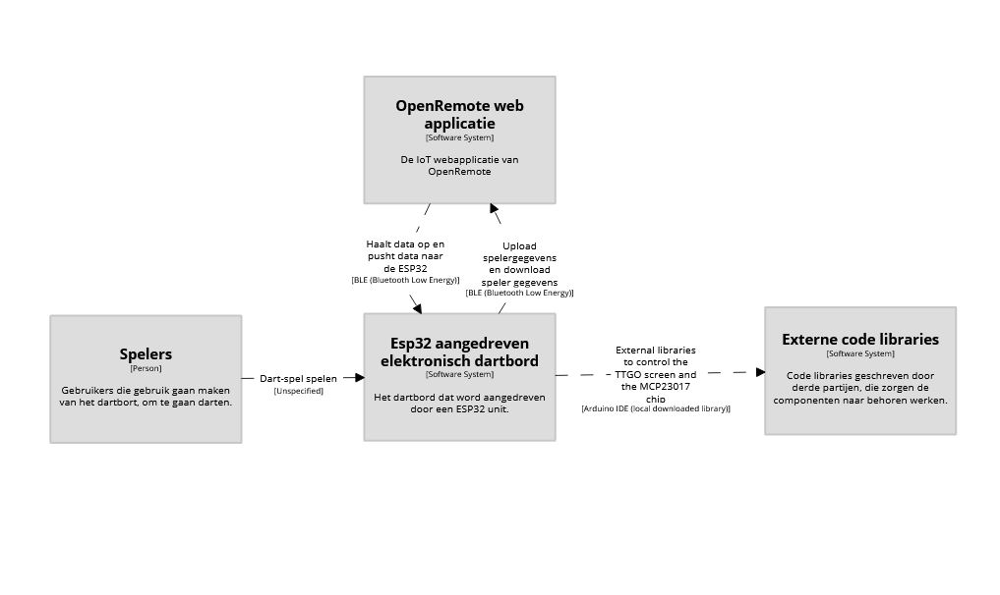
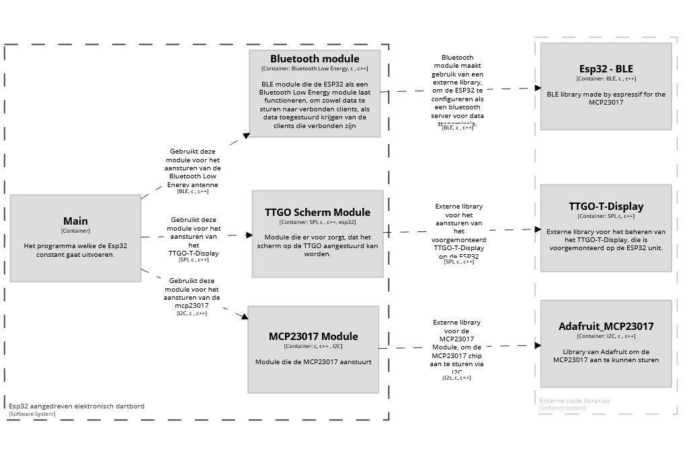
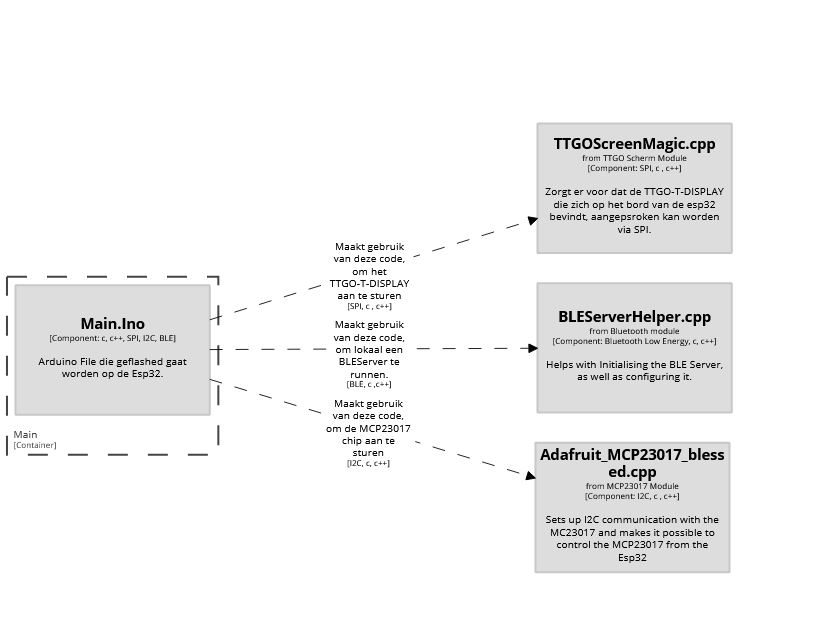
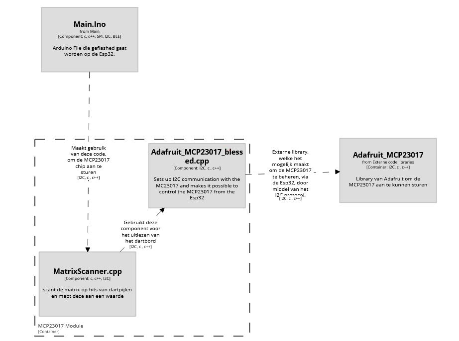
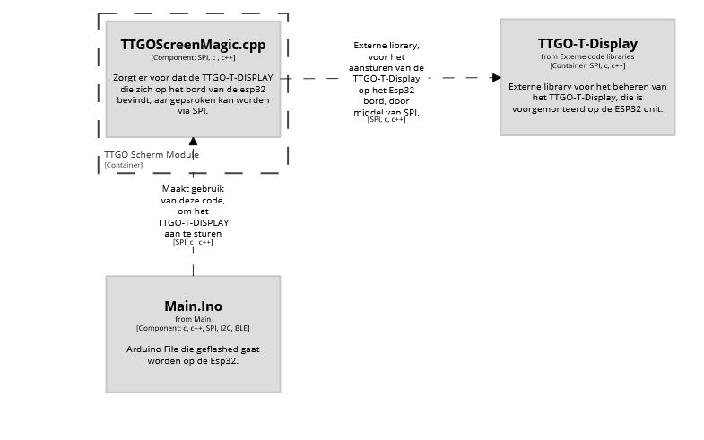
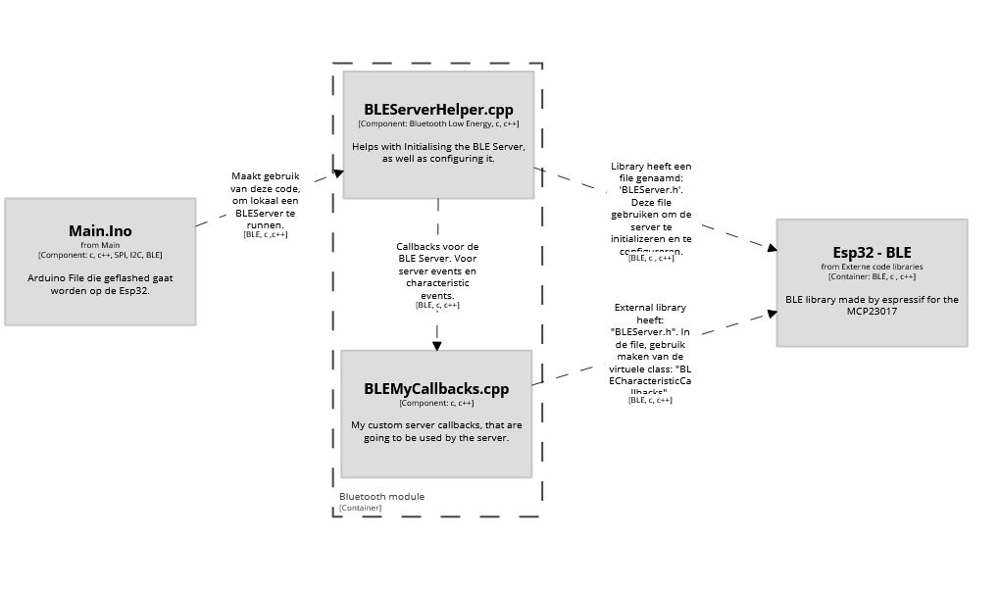

# ESP32 Code

## Diagrams

>**Note**
>
> The diagrams shown here, are made using the [C4 model](https://c4model.com/).
> 
> Also, the code diagrams will not be shown. We will provide you directly with the code.

### (C1) Context Diagram

>**Note**
>
>These diagrams are written in Dutch. I will do my best to translate them to English correctly.

#### Context overview
In the middle we see our "ESP32 drive electronical dartboard". To the left of the "ESP32 drive electronical dartboard" we see "Players". To the right, wee see "External code libraries." To the top, we see "OpenRemote web application".

* Players interact with the dartboard, throwing darts. No technologies are used for this.
* The ESP32 driven dartboard, will use external code libraries, to make use of the TTGO-T-Display(mounted on the ESP32), the MCP23017 I/O Extender and the Bluetooth Antenne (mounted on the ESP32).
* The Esp32 driven dartboard will also send hit-scan data of darts thrown to OpenRemote. (Using Bluetooth Low Energy)
* OpenRemote will also send data to the ESP32 driven dartboard when needed. (Using Bluetooth Low Energy)

### (C2) Container Diagram Esp32 Driven Dartboard

>**Note**
>
>The boxes in the diagram **that contain other boxes**, can each be seen as a repository.

This diagram shows the components that the Container: "Esp32 Driven Dartboard" consists of. We see that it's main component relies on 3 other components (which I called modules in the diagram). These 3 components, each further rely on a external component, obtained from a external library.

### (C3) Component Diagram Main

This diagram shows, what the "Main.ino" component needs from the other 3 components. This is:
* Using the "TTGOScreenMagic.cpp" component to utilize the TTGO-T-Display, from the ESP32, through SPI.
* Using the "BLEServerHelper.cpp" component to utilize the Bluetooth Low Energy Antenna, mounted on the ESP32.
* Using the "Adafruit_MCP23017_blessed.cpp" component to utilize the MCP23017 through I2C.

### (C3) Component Diagram MCP23017

Here we see the Main.ino component, reaching into the MCP23017 container, to use the MatrixScanner.cpp for controlling the MCP23017 and reading the output from the 8x8 button matrix.
 
### (C3) TTGO-Screen-Module

### (C3) Component Diagram Bluetooth Module

