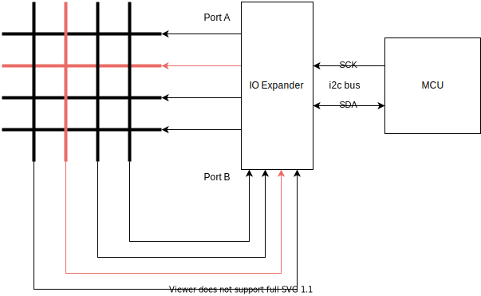

# Hardware

## Parts (per dartboard)
* A generic unbranded electronic dartboard (Our specific unit was called "[Playfun electronic dartboard"](https://www.intertoys.nl/shop/nl/intertoys/sportmaterialen-en-spelmaterialen/dartbenodigdheden/dartborden/playfun-elektronisch-dartbord))
* [LILYGO TTGO T-Display ESP32 module](http://www.lilygo.cn/prod_view.aspx?TypeId=50033&Id=1126&FId=t3:50033:3)
* An [MCP23017 16-Bit I/O Expander](https://ww1.microchip.com/downloads/en/devicedoc/20001952c.pdf) w/ I²C interface
* 5 * 7cm double-sided perfboard
* ~2m of Ø1.1mm wire

## Reading the dart hits

The hardware is based on a generic Chinese no-name dartboard which (like many of them) is based on a 8x8 button matrix to register dart hits (much like a keyboard). Using the MCP23017 16-bit I/O Expander, the ESP32 can use I²C to scan the matrix and register dart hits.

> **Note**
>
> Using the MCP23017, we are able to scan the dartboard every 7 milliseconds. This means that if a dart activates a dartboard-button for less than 7 milliseconds, which was sometimes the case in our testing, there's a possibility that the dart hit will not be registered. 
>
> The MCP23017 does support faster I2C frequencies than we are using, but this is only supported when powering the MCP23017 with 5 volts, which would require level converters between the ESP32 & the MCP23017 to keep I2C working.
>
> Possible fixes are to use the SPI-version of the MCP23017, the MCP23S17, or to find a different chip for driving the matrix altogether.

Because the original electronic dartboard matrix is made as one giant flexible printed circuit (FPC) and used a custom connector to connect to the original PCB, we decided to salvage the original FPC connectors and use them to connect the I/O expander to the dartboard matrix as well.

A simplified diagram of the matrix scanning using the I/O expander:

## Final hardware

Although we have made a digital schematic of the electronics of this project and we could have ordered a PCB, due to time constraints we ended up (poorly) soldering all of this together on a 5 * 7cm double-sided perfboard, using some Ø1.1mm wire to connect the chips & connectors together.

We then placed the assembly inside the casing of the dartboard, where the original PCB used to be situated. By careful measuring we made sur e that the placement of the FPC connectors should be 

**Perfboard front & back**

* **Red**: LILYGO TTGO T-Display ESP32 module
* **Blue**: MCP23017 16-Bit I/O Expander
* **Green**: Original dartboard Flexible Printed Circuit connectors